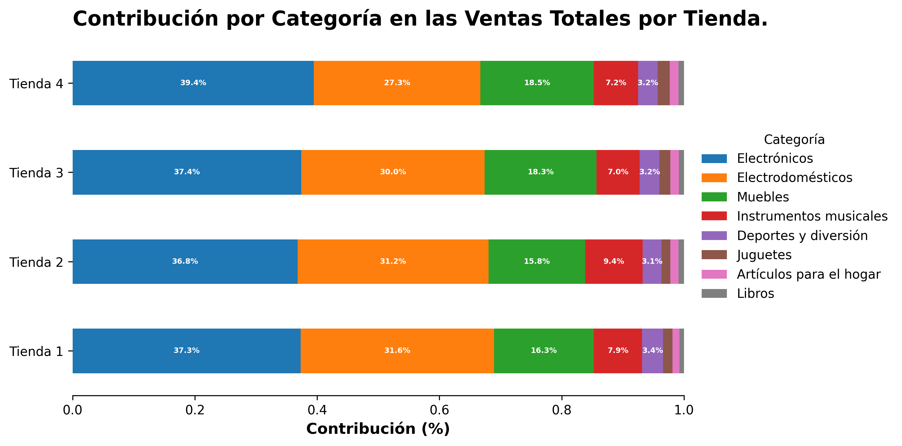
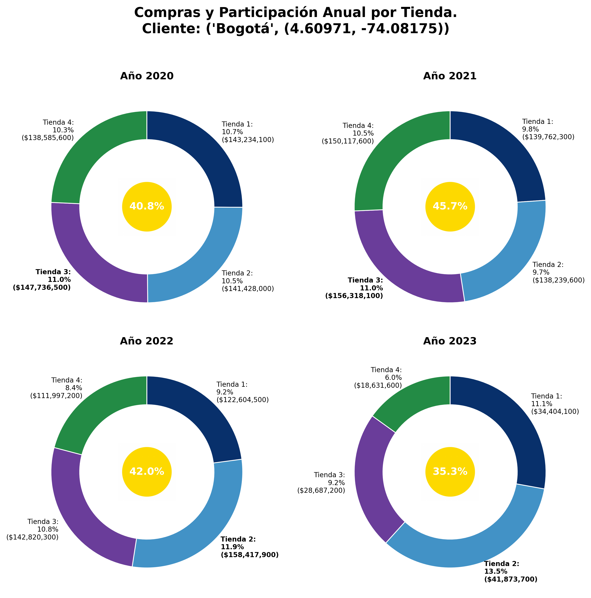
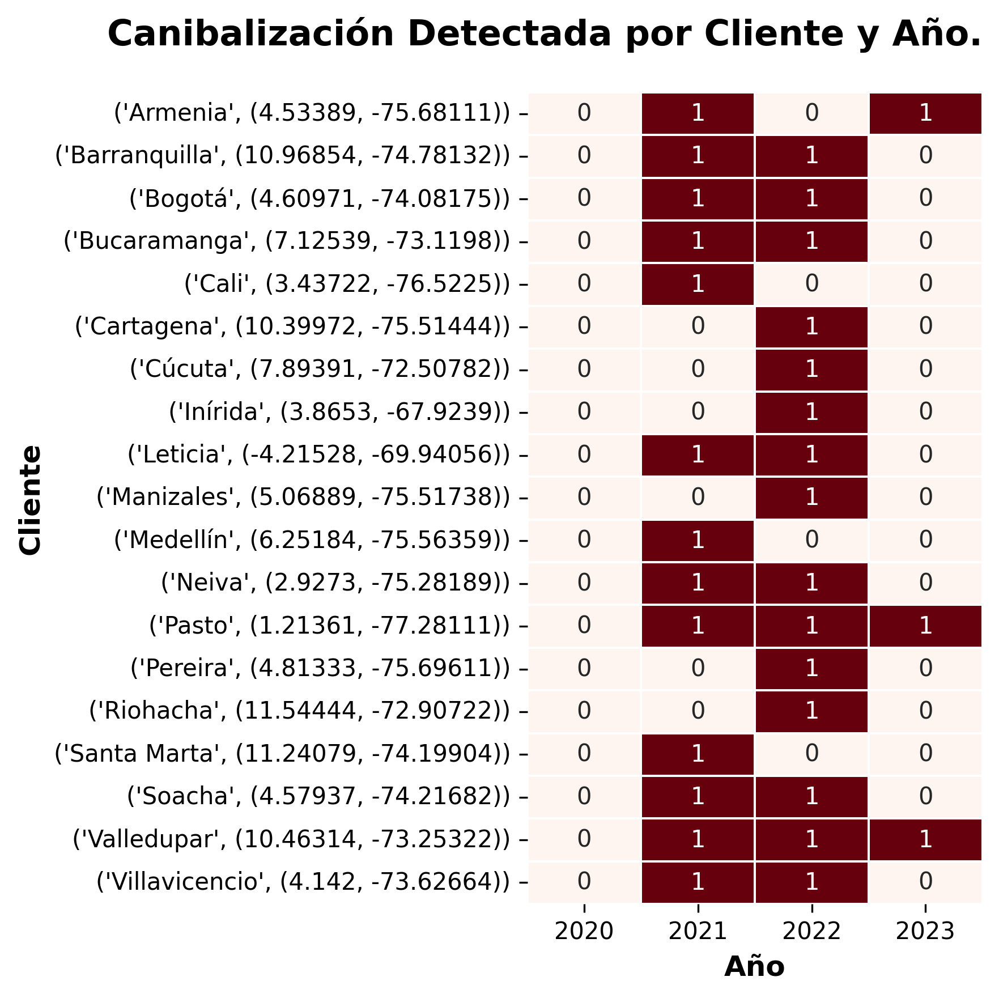

# 📊 Análisis de Rendimiento de Tiendas - Alura Store LATAM

Este repositorio contiene un informe analítico elaborado en Jupyter Notebook con el objetivo de apoyar al Sr. Juan, dueño de una cadena de tiendas, a tomar una decisión estratégica respecto a cuál de sus cuatro tiendas mantener o vender. El análisis se basa en datos de ventas, productos, clientes, métodos de pago y logística desde el año 2020 al 2023.

---

## 🧠 Objetivo

Evaluar el desempeño comercial y operativo de las tiendas, identificando:
- Ingresos anuales y totales por tienda.
- Productos y categorías más vendidos.
- Experiencia de compra (valoración).
- Riesgos de concentración y solapamiento de clientes.
- Canibalización entre tiendas.
- Ineficiencias logísticas y comerciales.

---

## 🛠️ Tecnologías utilizadas

- Python 3
- Pandas
- Matplotlib
- Seaborn
- Folium
- Jupyter Notebook / Google Colab

---

## ▶️ Ejecutar en Google Colab

Haz clic en el siguiente botón para abrir directamente el notebook:

[](https://colab.research.google.com/github/EuniceGarcia503/Challenge1_AluraStore/blob/main/AluraStoreLatam_FINAL_informe_con_graficos.ipynb)

---

## 📁 Estructura del Notebook

El análisis está dividido en secciones:

- 📥 Importación y exploración de datos
- 📈 Cálculos solicitados y complementarios
- 🧾 Análisis de clientes y productos
- 🌍 Geolocalización y riesgos estratégicos
- 📌 Conclusiones y recomendaciones

---

## 🖼️ Capturas del Informe

Debajo se incluyen celdas para agregar visualizaciones clave del análisis.

### 📸 Gráficos sugeridos

```markdown
#### 1. Ventas Totales por Tienda


#### 2. Ventas Anuales por Tienda


#### 3. Contribución por Categoría en las Ventas Totales


#### 4. Participación del Cliente (Bogotá) en Ventas Anuales por Tienda


#### 5. Canibalización Detectada por Cliente y Año


#### 6. 🌍 Mapa Geolocalización de Clientes
[Haz clic aquí para ver el mapa interactivo](https://htmlpreview.github.io/?https://raw.githubusercontent.com/EuniceGarcia503/Challenge1_AluraStore/main/Imagenes_AluraStore/mapa_geolocalizacion_clientes.html)
```

---

## 📄 Licencia

Este proyecto está desarrollado con fines académicos y de aprendizaje. Puede ser reutilizado mencionando la fuente.

---
